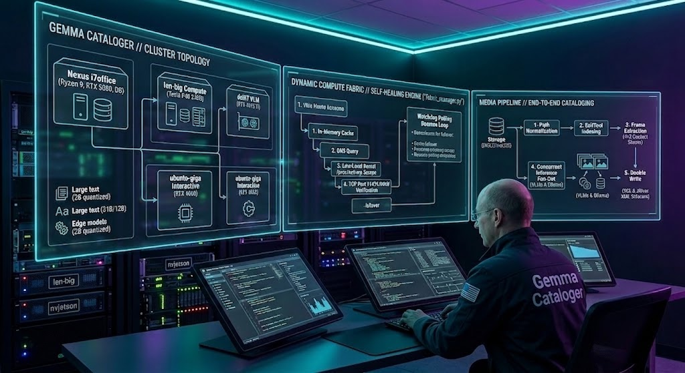

# Local Gemma 4 Offline Photo Cataloger (v2.1.0)

### 🔍 Private Offline AI Photo Cataloging, Natural Language PostgreSQL Querying, EXIF Metadata Embedding, and LAN Compute Fabric using Google Gemma 4 (v2.1.0)

A private, offline vision-language-driven photo cataloging pipeline. This application scans directory trees recursively, analyzes images in parallel, generates structured descriptive metadata, and optionally embeds descriptions natively back into the image file EXIF headers.

It runs entirely offline on local hardware using Google's encoder-free **Gemma 4 12B IT** multimodal model running natively on a GPU-accelerated Ubuntu (or WSL2) environment with BitsAndBytes 4-bit quantization, distributed across a high-speed local network compute fabric. WSL2 Docker container virtualization on Windows has been deprecated in favor of a pure native Windows-client/Ubuntu-server architecture.

> [!WARNING]
> **SQLite Backend Deprecation**:
> The SQLite database backend (`local/photo_catalog.db`) is now deprecated and maintained purely for legacy compatibility. PostgreSQL is now the primary, recommended database backend for metadata indexing and dynamic compute fabric querying.

> [!NOTE]
> **Looking for a Cloud-Based Pipeline?**
> If you want to use Google Cloud (Vertex AI Batch Jobs with Gemini) instead of running a local model server, please refer to the dedicated public repository:
> **[Gemini Photo Batch Workflow](https://github.com/smichalove/Gemini_Photo_Batch_Workflow)**

### ⚖️ Choosing Between Local VLM and Cloud Batch

Depending on your hardware capability, budget, and description requirements, you can choose between this local offline pipeline and the cloud-based workflow:

| Feature | 💻 Local VLM (This Repo) | ☁️ Cloud Batch ([Gemini_Photo_Batch_Workflow](https://github.com/smichalove/Gemini_Photo_Batch_Workflow)) |
| :--- | :--- | :--- |
| **Primary Model** | Gemma 4 12B IT (Quantized 4-bit) | Gemini 2.5 Flash / Pro |
| **Cost** | **100% Free** (No API or cloud charges) | Paid GCP Vertex AI API usage |
| **Hardware** | NVIDIA GPU with **16GB+ VRAM** (e.g., RTX 4080/5080/4090/5090 etc.) | Standard CPU / low-end systems (no local GPU needed) |
| **Speed** | Slower (limited by local GPU batch processing) | Extremely fast (processed in parallel by Vertex AI) |
| **Description Detail**| Structured JSON summaries (tags & environment) | Comprehensive, detailed descriptions & narrative paragraphs |
| **Data Privacy** | **Absolute** (all processing remains offline on-disk) | Images processed remotely via secure Google Cloud servers |
| **Database Chat Agent** | **Yes** (Conversational SQL-translating REPL client included) | **No** (Output is structured files/EXIF only) |

---

## 🛠️ System Architecture



*Visual blueprint of the private compute fabric distribution nodes and server routing topologies.*

---

## 🚀 Installation & Setup

### 1. Prerequisites

You must install **ExifTool** locally on the host machine:
*   **Windows**: Download `exiftool.exe` from the official website and add it to your system PATH (or specify its path in `.env` under `EXIFTOOL_PATH`).
*   **macOS / Linux**: Install via package manager (e.g. `brew install exiftool` or `sudo apt-get install exiftool`).

### 2. Environment Setup

1.  Clone this repository and navigate into it.
2.  Create and activate a Python virtual environment (`venv`) to keep your host environment isolated and clean:
    ```bash
    # Windows (PowerShell)
    python -m venv venv
    .\venv\Scripts\Activate.ps1

    # macOS / Linux
    python -m venv venv
    source venv/bin/activate
    ```
3.  Install the **host dependencies** (lightweight scripts for image base64 encoding, network calls, and EXIF embedding):
    ```bash
    pip install -r local/requirements.txt
    ```
4.  Copy `.env.example` to `.env`:
    ```bash
    cp .env.example .env
    ```
5.  Configure `.env` with your photo directories, database parameters, and execution parameters. Here is a baseline example of the configuration:
    ```env
    # Comma-separated list of directories to scan (e.g., C:\Pictures,D:\Photos)
    PICTURE_DIRECTORIES=C:\path\to\your\pictures,D:\another\folder

    # Database Backend Selection ('sqlite' [deprecated] or 'postgresql')
    DB_BACKEND=postgresql

    # PostgreSQL Connection Parameters (only used if DB_BACKEND=postgresql)
    DB_NAME=photo_catalog
    DB_USER=postgres
    DB_HOST=your-database-host-example.lan
    DB_PORT=5432

    # Database and tracking paths (SQLite legacy fallbacks)
    OUTPUT_DATABASE_PATH=photo_descriptions.json
    OUTPUT_DATABASE_SQLITE=local/photo_catalog.db
    SUBMITTED_CACHE_PATH=submitted_photos_cache.txt

    # Path to the ExifTool executable (defaults to "exiftool" if in system PATH)
    EXIFTOOL_PATH=exiftool

    # Optional Hugging Face Token (only needed for initial model download if weights aren't cached)
    HF_TOKEN=
    ```

> [!NOTE]
> **Host vs. Server Architecture**
> The host machine (Windows) handles lightweight coordination, file crawling, database writes, and metadata EXIF embedding. Heavy model dependencies (such as `torch`, `transformers`, and `bitsandbytes`) are completely offloaded to the native Ubuntu VLM server to optimize resources.

### 3. VLM Server Installation & Setup (Native Ubuntu)

*   **VLM Host Hardware**: An NVIDIA GPU with at least **16GB of VRAM** (e.g., RTX 5080, RTX 4080, or Ampere equivalents) installed in a workstation running a pure native Ubuntu installation.
*   **Deprecation Note**: Docker and WSL2 container virtualization on Windows are fully deprecated. Running the VLM natively on physical Ubuntu hardware eliminates VM translation layers, network latency, and memory allocation bottlenecks.

#### Setting up the Server on Ubuntu:
1. Clone the project repository (or mount it via SMB/network shares) on your Ubuntu host.
2. Install Python dependencies:
   ```bash
   pip install -r local/requirements_server.txt
   ```
3. Start the FastAPI model server:
   ```bash
   python -m uvicorn local.wsl_server:app --host 0.0.0.0 --port 8000
   ```
   *Alternatively, the server can be started on the command line or managed via local process utilities.*

To start or stop the model server locally via scripts (on Windows orchestrators, checking for remote VLM status):
- Run `.\start_server.bat` to ping or boot the server.
- Run `.\stop_server.bat` to release GPU VRAM resources.

> [!TIP]
> **Non-Blackwell Platform Customization**
> The server initialization script defaults to parameters optimized for Blackwell GPUs (`BNB_CUDA_VERSION=130`). If you are running on an older generation (e.g., Ada Lovelace RTX 40-series, Ampere RTX 30-series), you can customize the `BNB_CUDA_VERSION` environment flag inside [wsl_client.py](local/wsl_client.py) (e.g., to `121` or `118`) to match your GPU's CUDA runtime version.

### 4. LAN Compute Fabric Database Initialization

Version 2.1 introduces the **Modular Compute Fabric** (`fabric_manager.py`) which discovers and health-checks active VLM server nodes across your local area network (LAN).

To set up and register your active compute hosts:
1. Make sure your database server is running (e.g. PostgreSQL).
2. Configure the database connection parameters in your `.env` file (see `.env.example`).
3. Run the database setup script to create and seed the `compute_nodes` table in PostgreSQL:
   ```bash
   python local/instantiate_fabric_db.py
   ```

---

## 💻 Usage

### 1. Run via Batch Script (Windows Recommended)
You can run the pipeline directly using the provided Windows batch file. This automatically activates your `venv` and runs the orchestrator:
```bash
# Run from PowerShell / Command Prompt:
.\run_local_pipeline.bat

# You can also pass any CLI arguments directly to the batch file:
.\run_local_pipeline.bat --max-photos 50 --batch-size 1
```

#### Run on a Single Image
To force VLM evaluation and EXIF embedding on a single specific image (bypassing caches), run the prompt script:
```bash
# Run from PowerShell / Command Prompt:
.\run_single.bat
```
This script will prompt you to type or drag-and-drop the absolute path to your target image file.

### 2. Run via Python Command
Or run the orchestrator script manually:
```bash
python local/describe_photos.py --embed-exif --batch-size 2
```

> [!IMPORTANT]
> **VRAM & Batch Size Tuning**
> - The pipeline is default-tuned for a **12GB VRAM Blackwell GPU** (using a default batch size of `2` to prevent Out-of-Memory (OOM) crashes).
> - **Batch size tuning is required per GPU profile**: If your local model server crashes with CUDA OOM errors during batch evaluation, reduce the batch size (e.g., to `--batch-size 1`).
> - If you have a high-end card with larger VRAM (like a 16GB RTX 5080/4080 or 24GB RTX 5090/4090), you can increase the batch size (e.g., `--batch-size 4` or `--batch-size 8`) to accelerate pipeline performance.

This script automatically:
1. Spins up the WSL2 container.
2. Launches the FastAPI server inside it (if not already running).
3. Query the Compute Fabric registry (`fabric_manager.py`) to discover online nodes.
4. Crawls your configured image folders recursively.
5. Feeds Base64 image payloads in parallel CPU batches to active VLM nodes.
6. Serializes output tags to the local `photo_descriptions.json` database.
7. Natively embeds descriptions back to image EXIF file headers using ExifTool.

### ⚙️ Command-Line Arguments
Override default settings using the following runtime options:

| Option | Type | Default Value | Description |
| :--- | :--- | :--- | :--- |
| `--dir` | `str` (repeating) | None / env `PICTURE_DIRECTORIES` | Target directory to scan. Can be specified multiple times. |
| `--max-photos` | `int` | `100` / env `MAX_PHOTOS` | Maximum number of new images to describe in this run. |
| `--batch-size` | `int` | `2` | Batch size for model evaluation. Tune down to `1` if you encounter CUDA OOM errors. |
| `--max-workers` | `int` | `8` | Number of background CPU worker threads for fast image loading. |
| `--output` | `str` | `"photo_descriptions.json"` | Path to save the cataloged descriptions database. |
| `--db` | `str` | `"local/photo_catalog.db"` / env `OUTPUT_DATABASE_SQLITE` | Path to save the SQLite database catalog. Set to empty or None to disable. |
| `--submitted-cache` | `str` | `"submitted_photos_cache.txt"` | Log file tracking already-evaluated photos. |
| `--embed-exif` | Flag | `False` | Triggers background ExifTool execution to write description headers. |
| `--file` | `str` | None | Processes a single target file directly, bypassing skip caches. |
| `--force` | Flag | `False` | Forces re-evaluation of all target files, ignoring existing database records. |

---

## 💬 Interactive Database Chat REPL

The Interactive Database Chat client provides a conversational command-line interface (`db_chat_repl.py`) to query your cataloged photo database using natural language (e.g., "Find 15 photos with Paris and a river", "Find photos of motorcycles in Paris", or "Show me 5 photos taken in the forest").

It generates and runs SQL queries under the hood and outputs the results in a formatted markdown table or indexed list.

> [!NOTE]
> **Dual-Node Remote Architecture (Optional)**
> The codebase supports connecting a secondary REPL client node or remote model server (configured via the `--remote` flag along with `--host` and `--port` parameters). This enables querying the database from a separate workstation or network node. This is a specialized setup and is completely optional.

> [!WARNING]
> **Resource Limits & Coexistence**
> Using the REPL client to query the database *during active cataloging iterations* (i.e., while running `describe_photos.py` to index new batches) is **not recommended**. Executing heavy pipeline processes alongside active VLM querying can saturate GPU memory thresholds and trigger CUDA Out-of-Memory (OOM) crashes.

### Quick Start
To launch the database chat REPL:

#### Windows Host (CMD / PowerShell):
```cmd
# Local Mode (queries local VLM server running on localhost or loopback):
.\run_db_chat_local.bat

# Remote Mode (queries remote Ollama server by default):
.\run_db_chat.bat
```

#### Linux Host (Ubuntu / Ubuntu clones / WSL):
*Note: These scripts can be run natively under Ubuntu and other Linux clones, or under Windows WSL2 (by running `wsl -u {your_user}`).*
```bash
# Make the shell scripts executable:
chmod +x sh/*.sh

# Local Mode (queries local VLM server):
./sh/run_db_chat_local.sh

# Remote Mode (queries remote server):
./sh/run_db_chat.sh
```

Alternatively, run the python script directly:
```bash
# Local Mode
python local/db_chat_repl.py --db local/photo_catalog.db --prompt local/db_prompt.txt

# Remote Mode
python local/db_chat_repl.py --remote --host 127.0.0.1 --port 11434 --model gemma4-it-q4:latest
```

### Configuration & Parameterization
The REPL client loads default parameters dynamically from environment variables and supports full command-line overrides (no hardcoded endpoints or paths):
- **Database Path**: `--db` / env `OUTPUT_DATABASE_SQLITE` / default: `local/photo_catalog.db`
- **Prompt Path**: `--prompt` / env `DB_PROMPT_PATH` / default: `local/db_prompt.txt`
- **Local VLM URL**: `--local-url` / env `VLM_SERVER_URL` / default: `http://127.0.0.1:8000/analyze`
- **Remote Ollama Parameters**:
  - Model: `--model` / env `OLLAMA_MODEL` / default: `gemma4-it-q4:latest`
  - Host: `--host` / env `OLLAMA_HOST` / default: `127.0.0.1`
  - Port: `--port` / env `OLLAMA_PORT` / default: `11434`

### Special Commands
Within the REPL environment, you can use the following controls:
*   `/clear` or `/reset`: Clears conversational history queue (which maintains up to a 20-message window).
*   `open <index>` or `/open <index>`: Opens the photo corresponding to that bullet item index (e.g., `open 3`) in the host's default image viewer.
*   `/paste`: Enters multiline input paste mode. Type `/end` on a separate line to finish and send your prompt.
*   `exit` or `quit`: Exits the REPL.

---

## 🏷️ Standalone Metadata Embedding

The metadata embedding script (`embed_metadata.py`) reads the serialized description JSON database and calls ExifTool in optimized multi-threaded batches.

To trigger embedding manually on already-described photos:
```bash
python embed_metadata.py
```
This script reads the `.env` settings, normalizes file paths across operating systems via relative indexing, and writes descriptions to:
*   `Caption-Abstract` (IPTC)
*   `Description` (XMP)
*   `ImageDescription` (EXIF)

---

## 🗄️ Database Migrations

This release focuses strictly on direct PostgreSQL/SQLite database output and the DB Chat client interface. To keep the codebase lightweight and clean, utility scripts for importing/migrating legacy JSON catalogs are omitted from this core distribution. 

If you have existing photo databases saved in `photo_descriptions.json` format, you can easily write a simple Python script to import that JSON array and upsert its entries into the `photos` PostgreSQL/SQLite table. The table schema details are documented in `local/db_prompt.txt`.

## 🧪 Testing

Run the mock-based unit tests to verify script logic:
```bash
# Test the image describer pipeline logic
python -m unittest tests/test_describe_photos.py

# Test the DB Chat REPL client logic
python -m unittest tests/test_db_chat_repl.py
```
