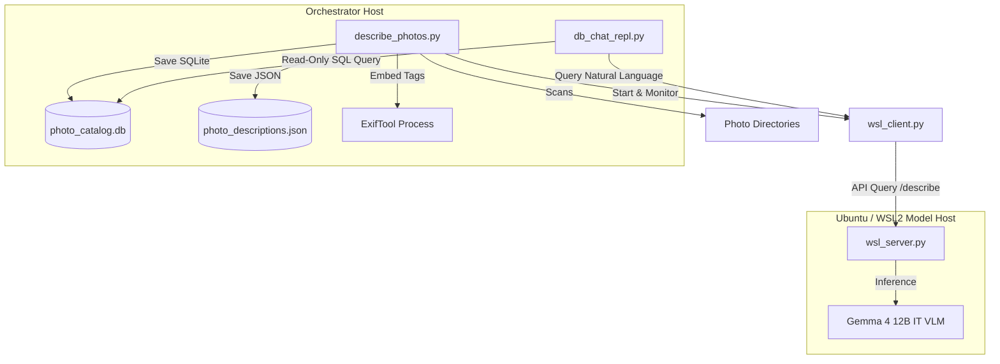

# Google Python Style & Engineering Guidelines

> [!IMPORTANT]
> This document serves as the official instruction manual for any AI agent or developer contributing to this codebase on Windows and cross-platform setups. Always adhere to these guidelines before writing, modifying, or executing code.

---

## 1. System Performance & Model Guidelines

Leverage the system's hardware configuration to maximize performance where possible (e.g., using larger batches, caching, multi-processing, GPU acceleration, or more thread workers):
*   **CPU**: High-performance multi-core CPU (e.g., AMD Ryzen or Intel Core series)
*   **GPU**: NVIDIA GPU with 16GB+ VRAM (e.g., RTX 4080 / 5080 / 4090 / 5090)
*   **Memory**: 32GB+ RAM
*   **I/O vs GPU Inference Bottlenecks**: Do not overestimate I/O bottlenecks during local VLM batch inference. Because model inference on the GPU takes significantly longer than reading and base64-encoding images on a high-speed CPU/SSD, CPU pre-processing finishes well before the GPU is ready. Consequently, scaling CPU threads/workers (e.g., raising `--max-workers` beyond the default 8) yields no performance speedup. Focus optimization efforts on model batch sizes and memory caching rather than I/O parallelism.
*   **Model Confirmation**: If you feel a need to change models, this MUST be confirmed and approved by the user prior to making any changes.

---

## 2. Docstrings and Documentation

All classes, methods, and functions must have docstrings. Docstrings should follow the Google Python Style Guide format.

### Function and Method Docstrings
Every function must include:
1. A single-line summary of what the function does (ended with a period).
2. A detailed description (optional, if the function is complex).
3. An `Args:` section detailing all parameters, their types, and roles.
4. A `Returns:` section describing the return value and its type.
5. A `Raises:` section detailing any exceptions raised by the function (if applicable).

**Example:**
```python
def calculate_tempo_offset(bpm: float, multiplier: float) -> float:
    """Calculates the adjusted tempo based on a modifier.

    Args:
        bpm: The baseline tempo in Beats Per Minute (BPM).
        multiplier: The scale factor to apply to the tempo.

    Returns:
        The adjusted tempo value as a float.

    Raises:
        ValueError: If the input bpm or multiplier is negative.
    """
    if bpm < 0 or multiplier < 0:
        raise ValueError("Inputs must be non-negative.")
    return bpm * multiplier
```

### Class Docstrings
Classes must include:
1. A summary of the class's purpose.
2. An `Attributes:` section detailing all public attributes and their types.

**Example:**
```python
class TrackMetronome:
    """Manages metronome clicks and timing intervals for a song.

    Attributes:
        bpm: The current tempo in Beats Per Minute.
        time_signature: String representing the signature (e.g. '4/4').
    """
    def __init__(self, bpm: float, time_signature: str) -> None:
        self.bpm = bpm
        self.time_signature = time_signature
```

---

## 3. Type Annotations (Strict Typing)

*   All function signatures must use strict PEP 484 type annotations for parameters and return types.
*   Use `None` explicitly as the return type for functions that do not return a value.
*   Import standard generic typing types from the `typing` module (e.g. `List`, `Dict`, `Tuple`, `Optional`, `Any`).
*   Annotate complex local variable declarations if their types are not immediately obvious.

**Example:**
```python
from typing import List, Optional

def get_track_titles(file_paths: List[str]) -> List[str]:
    titles: List[str] = []
    for path in file_paths:
        title: Optional[str] = extract_title(path)
        if title:
            titles.append(title)
    return titles
```

---

## 4. Comments and Code Explanation

*   **Explain "Why", Not "What":** Code should be self-documenting. Use comments to explain the design decisions, assumptions, performance optimizations, or constraints.
*   **Inline Comments:** Use two spaces before inline comments. Comments should start with a `#` and a single space.
*   **Block Comments:** Use block comments to explain non-obvious logic steps.

**Example:**
```python
# We use a ThreadPoolExecutor here to exploit the Ryzen 9's 32 threads.
# Running network I/O in parallel cuts GCS upload times dramatically.
with concurrent.futures.ThreadPoolExecutor(max_workers=num_workers) as executor:
    executor.map(process_file, files)
```

---

## 5. Prompts Isolation

*   **No Embedded Prompts**: Prompts, system instructions, and schemas must never be hardcoded as string literals in python scripts.
*   **External Text Files**: All prompts must be stored in dedicated external `.txt` files (e.g., `prompt.txt`, `db_prompt.txt`, `hit_and_run_prompt.txt`) and loaded dynamically at runtime right before invoking the model to allow operator adjustments in real-time.

---

## 6. Database REPL Client Guidelines

When writing or maintaining interactive database querying clients (like `db_chat_repl.py`):
*   **Read-Only Safety**: Database connections for executing VLM-generated SQL queries must be opened in read-only mode (`mode=ro`) to prevent mutation of the catalog database.
*   **Linear Context History**: Retain the complete conversational turns (including intermediate assistant tool calls and `TOOL RESULT:` message structures) in the chat history queue to preserve context across multiple conversation turns.
*   **Compact Model Feeds**: Present tool result data to the model in standard Markdown table format (with single backslashes `\`) to maximize token efficiency and prevent JSON double-backslash `\\` path confusion.
*   **Truncation Guardrails**: Limit the total return (e.g., slicing query result lists to a maximum of 50 rows) to protect context window safety while maintaining full description cell values.

---

## 7. System Architecture & Codebase Design

This section outlines the logical layout and interactions of the offline photo cataloging pipeline.

### Architectural Overview
The system is built on a **decoupled architecture** that splits host orchestration from VLM inference to optimize execution speed and resource management:
- **Host (Windows)**: Handles photo directory crawling, deduplication checking, concurrent base64 image pre-loading, database cataloging (JSON file & SQLite DB), and EXIF metadata writing.
- **VLM Server (Ubuntu)**: Hosts Google's **Gemma 4 12B IT** Vision-Language Model natively inside a GPU-accelerated pure Ubuntu environment running FastAPI/Uvicorn, leveraging native Linux CUDA performance.
  > [!IMPORTANT]
  > **WSL & Docker Deprecation Note**: Local WSL2 and Docker container virtualization on Windows are fully deprecated for VLM hosting. The system is designed as a pure Windows (orchestrator client) and Ubuntu (native model server) setup, running directly on physical hardware.
  >
  > **Performance & VRAM Management Benefits**:
  > 1. **Zero-Overhead GPU Access**: Offloading the VLM server to a native Ubuntu host running directly on physical hardware avoids virtualized GPU drivers, VM translation delays, and container virtualization overhead, providing raw, zero-overhead CUDA/VRAM performance.
  > 2. **VRAM Saturation & Memory Safety**: Native Linux environments handle VRAM allocation and garbage collection (gc) far more robustly than WSL2, preventing memory leaks, context-switching freezes, and VRAM fragmentation crashes under long-running batch indexing tasks.
  > 3. **Native Linux Filesystem Speeds**: Quantized weights (e.g. 4-bit NF4/INT4 via `torchao` or `ollama`) load directly from physical NVMe drives to VRAM at native bus speeds, bypassing slow WSL mounts.



### Component Reference & Roles

1. [describe_photos.py](file:///h:/photo_catloger_decoupled_pub/local/describe_photos.py)
   - **Role**: Core orchestrator script that coordinates directory scanning, caching, VLM queries, and metadata embedding.
   - **Core Flow**:
     - Recursively walks target directories and gathers supported image files.
     - Loads current descriptions JSON database (`photo_descriptions.json`) to skip already processed images.
     - Spawns background CPU worker threads (using `ThreadPoolExecutor`) to load and base64-encode image files.
     - Sends batches of image payloads to the VLM server.
     - Normalizes VLM raw output JSON structure.
     - Saves records atomically using a thread-safe `json_lock` to prevent filesystem corruption.
     - Inserts/upserts entries directly into the SQLite database.
     - Optionally submits ExifTool tasks to a single-threaded background queue to embed description strings back into the images.

2. [wsl_client.py](file:///h:/photo_catloger_decoupled_pub/local/wsl_client.py)
   - **Role**: Coordinates host-to-WSL2/Ubuntu operations, managing the model server process lifecycle and server HTTP communications.
   - **Core Flow**:
     - Detects the host platform (Windows vs. native Linux/macOS).
     - On Windows, uses WSL/Docker commands to restart and control the container. On Linux/macOS, starts `uvicorn` natively in the background and controls it via local process signals.
     - Checks if the uvicorn process is active; if not, launches it.
     - Polls `/docs` to wait for model weights loading (which can take up to 7.5 minutes).
     - Dispatches batched base64 image strings and prompt text via POST request.

3. [wsl_server.py](file:///h:/photo_catloger_decoupled_pub/local/wsl_server.py)
   - **Role**: FastAPI backend running natively on Ubuntu/Linux representing the offline VLM inference engine.
   - **Core Flow**:
     - Applies monkey-patch `patch_gemma4_unified` to patch `Gemma4UnifiedVisionEmbedder.forward` dynamically to bypass a known BitsAndBytes 4-bit LayerNorm casting bug.
     - Loads pre-compiled 4-bit quantized weights if available on disk. Otherwise compiles the base model on-the-fly and saves the quantized checkpoint.
     - Serves `/describe` POST endpoint, converting base64 arrays back into PIL images, preparing prompt templates, and appending a prefilled JSON tag to enforce structured JSON block generation.

4. [db_chat_repl.py](file:///h:/photo_catloger_decoupled_pub/local/db_chat_repl.py)
   - **Role**: Interactive command-line client enabling operators to query catalog databases via natural language.
   - **Core Flow**:
     - Connects to SQLite database in read-only mode (`mode=ro`) to prevent mutation of the catalog from VLM-generated SQL.
     - Instantiates chat prompt utilizing system prompt template (`db_prompt.txt`) containing schema details and syntax restrictions.
     - Polls local VLM (or remote Ollama endpoint) to translate user questions into SQL, runs query, and formats output.
     - Limits returned database rows to 50 to protect context window size.
     - Implements CLI commands: `/clear` (wipes history window), `/paste` (multiline text input), `/fabric` (lists active compute nodes), and `/open <index>` (calls host's default viewer; may require customization in `path_utils.py` for headless or WSL2 host sessions).

5. [embed_metadata.py](file:///h:/photo_catloger_decoupled_pub/embed_metadata.py)
   - **Role**: Standalone post-processing script for high-performance bulk EXIF embedding.
   - **Core Flow**:
     - Filters out already embedded photos using `embedded_photos_cache.txt`.
     - Chunks files into batches (default 200) and writes temporary import JSON.
     - Invokes ExifTool using the `-j` batch import option for massive speedups.
     - Falls back to single file updates (`update_metadata_single`) upon failure.
     - Auto-recovers from Photoshop IRB resource issues (`-Photoshop:All=`) and lock conflicts (`_exiftool_tmp`).
     - Appends success paths to cache under thread lock.

6. [tests/test_describe_photos.py](file:///h:/photo_catloger_decoupled_pub/local/tests/test_describe_photos.py) and [tests/test_db_chat_repl.py](file:///h:/photo_catloger_decoupled_pub/local/tests/test_db_chat_repl.py)
   - **Role**: Test suites running local unit validations for JSON payload extraction, helper methods, regex query parsing, and command execution paths.

---

## 8. Database Schema & Data Models

### VLM JSON Layout
The description records generated by the model conform to the following schema:
- `primary_subject` (str): Visual description of main subject (pose, visual description).
- `environment` (str): Scene setting (indoors/outdoors, lighting, weather).
- `suggested_tags` (list of str): Search tags.

### SQLite Database Schema
The database `photo_catalog.db` holds a table `photos` structured as follows:
- `id` (INTEGER PRIMARY KEY AUTOINCREMENT)
- `full_path` (TEXT UNIQUE NOT NULL): Windows absolute path to photo file.
- `rel_path` (TEXT NOT NULL): Normalized relative path relative to configured scan root.
- `primary_subject` (TEXT): Subject description.
- `environment` (TEXT): Scene description.
- `suggested_tags` (TEXT): JSON-serialized array of strings.
- `technical_details` (TEXT): Camera details.
- `detected_objects` (TEXT): JSON-serialized array of strings.

---

## 9. Critical Edge Cases & Development Precautions

- **Windows vs. Linux Paths**: When importing JSON data batches into ExifTool, path keys ("SourceFile") must use forward-slash separators (e.g. `C:/Photos/image.jpg`) even on Windows, as backslashes will prevent ExifTool from mapping the imported JSON to the physical disk files.
- **Subprocess Argument Lists**: In `wsl_client.py` and `embed_metadata.py`, commands run via `subprocess.run` must be passed as lists (e.g. `["pgrep", ...]`) instead of plain strings with `shell=True` to avoid argument tokenization/escaping errors.
- **WSL2 Resource Limits**: Executing indexing runs and database queries simultaneously can overwhelm GPU VRAM/RAM, triggering CUDA OOMs or process crashes. Avoid running active cataloging and chat loops concurrently on the same GPU.
- **BitsAndBytes LayerNorm Casting**: Standard HuggingFace library implementations fail to cast LayerNorm weight matrices properly under 4-bit quantization, causing `Gemma4UnifiedVisionEmbedder` runtime errors. Ensure `patch_gemma4_unified` is always imported and run before initializing VLM weights on startup.
- **Blackwell GPU Optimizations**: The model server launches inside the WSL2/Ubuntu environment with environment flag `BNB_CUDA_VERSION=130` (in `wsl_client.py`), which optimizes BitsAndBytes execution for Blackwell generation GPUs (like RTX 5080 / 5090). For non-Blackwell architectures (e.g. RTX 4080 Ada Lovelace, RTX 3080 Ampere, etc.), this environment variable should be edited/tuned to match the device's CUDA runtime version (e.g., `121` or `118`) to prevent runtime warning flags or performance drops.


---

## 10. Post-Mortem Logs

### Session 2026-07-18: Resolution of static analysis import error for `db_chat_repl`

* **Failure**: Static analysis engines (like Pylance/VS Code) and local test discovery tools reported `Cannot find module db_chat_repl` when inspecting `tests/test_db_chat_repl.py` or references to `local/db_chat_repl.py`.
* **Root Cause**: The script `db_chat_repl.py` and other modules are located inside the nested directory `local/`. The unit tests programmatically inject `local/` into `sys.path` at runtime, but static analyzers do not run Python code, so they could not locate the modules.
* **Resolution**:
  1. Configured the workspace-level `.env` file to set `PYTHONPATH=local`.
  2. Created `.vscode/settings.json` specifying `python.analysis.extraPaths` and `python.autoComplete.extraPaths` for `./local` to natively instruct editors to resolve modules within that directory.
  3. Ran a full workspace compilation check (`python3 -m compileall -f .`) to ensure syntax compatibility across all modules.

### Session 2026-07-18 (Part 2): Deprecation of Windows WSL/Docker and Integration of Native Ubuntu VLM Host

* **Failure**: The codebase was hardcoded to execute server control commands via `wsl -u workbench docker exec` etc. When running on native Linux (Ubuntu) or macOS, this raised unhandled `FileNotFoundError` exceptions because the `wsl` command does not exist.
* **Root Cause**: The project architecture was originally structured around Windows + WSL2 + Docker container virtualization. However, Docker on Windows has been deprecated, and VLM model hosting is transitioned to a native Ubuntu/Linux environment, making the WSL/Docker wrappers obsolete.
* **Resolution**:
  1. Updated `wsl_client.py` to dynamically detect the OS platform at runtime using the `platform` module.
  2. Bypassed WSL and Docker commands when running on non-Windows platforms (Linux/macOS), calling local commands like `pgrep` and `pkill` directly on the host.
  3. Integrated a native background execution flow using `subprocess.Popen` to launch the local `uvicorn` FastAPI server directly when running on native Linux.
  4. Updated documentation in `agents.md` and `README.md` to formally deprecate WSL/Docker containerization and explain the pure Windows-client/Ubuntu-server native setup.
  5. Documented performance and VRAM management benefits (zero-overhead GPU access, filesystem speeds, and memory safety) of native Ubuntu hosting in the project's documentation.
  6. Added the `/fabric` and `/nodes` commands to the help instructions of `db_chat_repl.py` and updated `agents.md` to improve feature discoverability.
  7. Created a dedicated `sh/` directory containing equivalent Bash shell scripts for Linux/Ubuntu users, documenting in `README.md` that they can be run directly on native Ubuntu and other Linux clones, or under Windows WSL2 (via `wsl -u {user}`). Standardized the batch/shell scripts names to `run_cataloger.bat` and `sh/run_cataloger.sh` to match development workflows.
  8. Handled unrecognized CLI arguments (`--db` and `--prompt`) in `db_chat_repl.py` invocation within `.sh` and `.bat` scripts by passing them as environment variables (`DB_PATH` and `PROMPT_FILE`) instead, preventing CLI parser crashes. Added environment-specific customization notes for `/open` in documentation.


